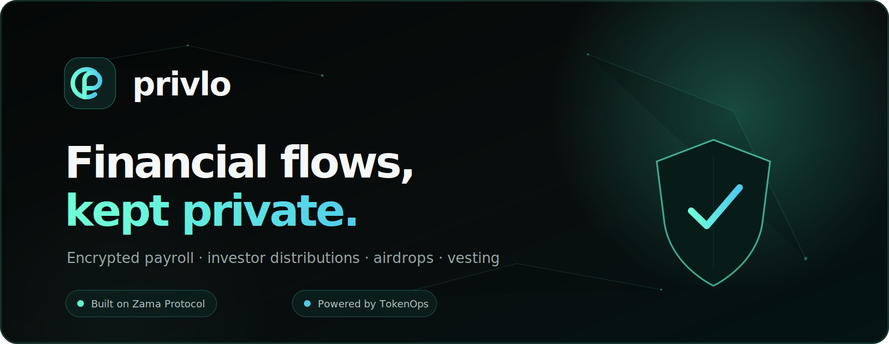
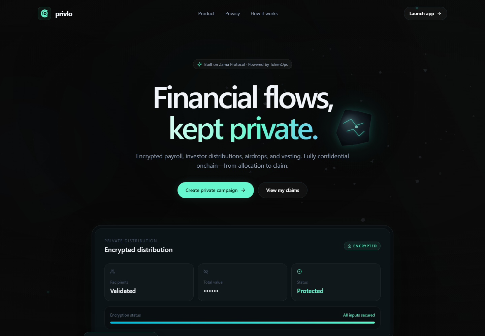
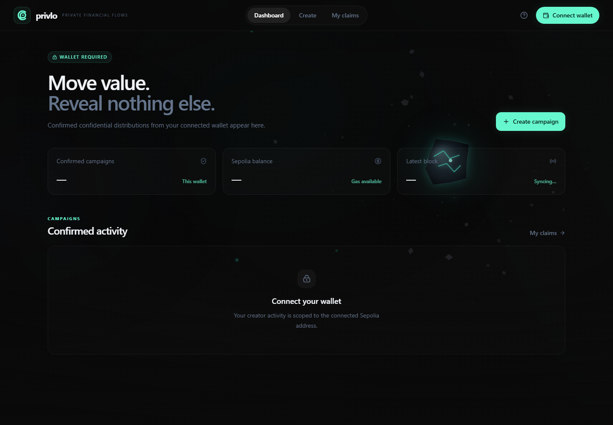

<div align="center">
  

  <br />

  <p>
    <strong>Confidential distribution layer for onchain teams — built with the TokenOps SDK on Sepolia.</strong>
  </p>

  <p>
    Creators run encrypted <strong>Disperse</strong> or <strong>Airdrop</strong> campaigns via TokenOps'
    pre-deployed contracts. Recipients decrypt only their allocation, then claim onchain. Also ships a
    production client for the Zama Confidential Wrapper Registry (wrap, unwrap, EIP-712 decrypt).
  </p>

  <p>
    <a href="https://privlo.vercel.app/app/campaigns/new"><strong>Live demo</strong></a>
    &nbsp;&middot;&nbsp;
    <a href="#tokenops-special-bounty"><strong>TokenOps bounty</strong></a>
    &nbsp;&middot;&nbsp;
    <a href="#wrappers-registry-bounty"><strong>Registry bounty</strong></a>
    &nbsp;&middot;&nbsp;
    <a href="#quick-start"><strong>Run locally</strong></a>
    &nbsp;&middot;&nbsp;
    <a href="#how-to-use-privlo"><strong>How to use</strong></a>
    &nbsp;&middot;&nbsp;
    <a href="./docs/protocol-integration.md"><strong>Protocol notes</strong></a>
  </p>

  <p>
    
    
    
    
    
  </p>
</div>

---

## TokenOps Special Bounty

**Live:** [https://privlo.vercel.app/app/campaigns/new](https://privlo.vercel.app/app/campaigns/new) · **Claims:** [https://privlo.vercel.app/app/claims](https://privlo.vercel.app/app/claims) · **Network:** Sepolia · **Source:** [github.com/Datwebguy/privlo](https://github.com/Datwebguy/privlo)

Privlo is a wallet-native product layer on the published [`@tokenops/sdk`](https://www.npmjs.com/package/@tokenops/sdk) package and TokenOps' pre-deployed Sepolia contracts:

| Requirement | Implementation |
| --- | --- |
| Confidential Disperse | `fhe-disperse` client → TokenOps Sepolia singleton |
| Confidential Airdrop | `fhe-airdrop` client → Airdrop factory + recipient claim flow |
| ERC-7984 confidential tokens | CTTT test token + operator approvals before execution |
| Client-side encryption | Zama FHE worker pre-warm + encrypt before tx submission |
| CSV + manual recipients | Validated import with review-step privacy checklist |
| TokenOps preflight | Runs before every Disperse / Airdrop write |
| Recipient-controlled reveal | EIP-712 scoped decryption at `/app/claims` |
| Claim with original payload | Never regenerates issuer-signed encrypted input |

**Demo path:** Create campaign → wait for privacy engine warmup (first visit, up to ~90s) → execute Airdrop → recipient opens claims → Decrypt amount → Claim.

See [How to use Privlo](#how-to-use-privlo) and the [3-minute video script](./docs/video-pitch-tokenops-bounty.md).

## Wrappers Registry bounty

**Live:** [https://privlo.vercel.app/app](https://privlo.vercel.app/app) · **Network:** Sepolia · **Source:** [github.com/Datwebguy/privlo](https://github.com/Datwebguy/privlo)

Privlo is a production-ready client for the [Zama Confidential Wrapper Registry](https://docs.zama.org/protocol/protocol-apps/addresses/testnet/sepolia.md). It satisfies the bounty requirements:

| Requirement | Implementation |
| --- | --- |
| Browse onchain registry pairs | `useListPairs({ metadata: true })` on Sepolia registry |
| Wrap / unwrap every pair | `useShield` / `useUnshield` per selected pair |
| EIP-712 decrypt any ERC-7984 | `ConfidentialBalancePanel` + arbitrary token panel |
| Official cTokenMock faucet | `MockFaucetPanel` calls underlying `mint()` on mock pairs |
| Local pair configuration | [`src/config/wrapper-pairs.local.ts`](src/config/wrapper-pairs.local.ts) merged at runtime |

### Registry contract

| Contract | Sepolia address |
| --- | --- |
| Wrappers Registry | [`0x2f0750Bbb0A246059d80e94c454586a7F27a128e`](https://sepolia.etherscan.io/address/0x2f0750Bbb0A246059d80e94c454586a7F27a128e) |

Pairs are loaded from this onchain registry first. Privlo does not hardcode the official mock list — it reads whatever the registry returns (cUSDC, cUSDT, cWETH, cBRON, cZAMA, ctGBP, cXAUt, and future entries).

### Add a custom pair locally

Edit [`src/config/wrapper-pairs.local.ts`](src/config/wrapper-pairs.local.ts) and append a pair (onchain entries with the same confidential address take precedence):

```ts
export const localWrapperPairs: LocalWrapperPair[] = [
  {
    tokenAddress: "0xYourErc20",
    confidentialTokenAddress: "0xYourErc7984",
    label: "My dev pair",
    faucetEnabled: true, // show mint faucet when underlying exposes mint()
  },
];
```

Restart the dev server or redeploy. The Registry page at `/app` picks up local pairs automatically.

### Registry workflow

1. Connect an injected wallet and switch to **Sepolia**.
2. Open **Registry** (`/app`) — pairs load from the onchain registry (+ any local pairs).
3. On mock pairs, use **Mint starter** to claim underlying tokens from the public `mint()` faucet.
4. **Wrap** ERC-20 into the confidential ERC-7984 token.
5. **Reveal** your encrypted balance (EIP-712 Zama user decryption).
6. **Unwrap** back to ERC-20 when needed.
7. Paste any ERC-7984 address in **Decrypt any balance** to decrypt outside the pair list.

Confidential payroll / airdrop campaigns (`/app/campaigns`) are the primary TokenOps Special Bounty workflow; the registry UI at `/app` is an additional Zama integration.

## About Privlo

Public blockchains make transfers verifiable, but they also expose sensitive financial
relationships. A payroll transaction can reveal compensation. An investor distribution can expose
allocation sizes. A public airdrop can reveal every recipient's balance.

**Privlo is the private distribution layer for onchain organizations.**

Creators prepare a campaign, encrypt each amount in the browser, and execute it through TokenOps'
pre-deployed confidential contracts. Recipients connect their own wallet, privately reveal only
their authorized amount, and claim it on Sepolia.

> **Privacy promise:** allocation amounts remain encrypted from campaign creation through recipient
> claim. Privlo does not intentionally publish plaintext amounts in transactions, URLs, analytics,
> or public campaign records.

## Why we built it

Onchain finance should be composable without forcing companies and contributors to publish their
entire financial graph. Privlo combines familiar EVM wallets and transaction flows with
programmable confidentiality, so privacy becomes part of the product rather than an extra manual
process.

<table>
  <tr>
    <td width="25%"><strong>Private payroll</strong><br />Pay contributors without publicly exposing individual compensation.</td>
    <td width="25%"><strong>Investor payouts</strong><br />Distribute confidential allocations while preserving onchain settlement.</td>
    <td width="25%"><strong>Encrypted airdrops</strong><br />Issue recipient-bound claims without publishing allocation amounts.</td>
    <td width="25%"><strong>Team distributions</strong><br />Move confidential ERC-7984 tokens across a team or community.</td>
  </tr>
</table>

## Product preview

### Privacy-first landing experience



### Wallet-scoped creator dashboard



The interface intentionally shows no fabricated volume, balances, campaigns, or claim data. Values
appear only when they can be derived from the connected wallet, Sepolia RPC, or confirmed Privlo
transactions.

## How it works


1. **Connect:** Privlo connects an injected wallet and enforces Sepolia before any write.
2. **Compose:** The creator chooses Disperse or Airdrop and enters recipients manually or by CSV.
3. **Encrypt:** Token amounts are converted using the token's real decimals and encrypted for the
   selected TokenOps contract.
4. **Execute:** Privlo performs TokenOps preflight checks, requests the required ERC-7984 operator
   approval, and submits the transaction.
5. **Reveal and claim:** The recipient obtains ACL access, requests Zama user decryption for their
   encrypted handle, then submits the original TokenOps claim authorization.

## Feature status

| Capability | Status | Notes |
| --- | :---: | --- |
| Wrappers Registry browser | Ready | Onchain `useListPairs` + local pair merge |
| Wrap / unwrap (shield / unshield) | Ready | Per-pair `useShield` / `useUnshield` on Sepolia |
| EIP-712 confidential balance reveal | Ready | ACL grant + `useUserDecrypt` for any ERC-7984 |
| cTokenMock underlying faucet | Ready | Public `mint()` on official mock pairs |
| Local wrapper pair config | Ready | `wrapper-pairs.local.ts` documented in README |
| Wallet connection and network switching | Ready | Injected wallets, Sepolia enforcement, actionable errors |
| Manual recipient entry | Ready | Address, amount, duplicate, and decimal validation |
| CSV recipient import | Ready | Reviewable before encryption or submission |
| Confidential Disperse | Ready | Uses the TokenOps Sepolia singleton |
| Confidential Airdrop | Ready | Funding, encryption, EIP-712 authorization, and claim |
| Private recipient reveal | Ready | Zama ACL grant and user-scoped decryption |
| CTTT test-token faucet | Ready | Supports end-to-end Sepolia testing |
| Simple Vesting | Planned | Visible but deliberately disabled until execution is complete |
| Cross-device claim inbox | Ready | Signed Privlo API via `VITE_PRIVLO_API_URL`; localStorage fallback when unset |

## Quick start

### Prerequisites

- [Node.js 22+](https://nodejs.org/)
- npm 10+
- A browser wallet such as MetaMask
- Sepolia ETH for transaction fees

### Install and run

```bash
git clone https://github.com/Datwebguy/privlo.git
cd privlo
npm install
```

Create your local environment file:

```bash
# Windows PowerShell
Copy-Item .env.example .env.local

# macOS or Linux
cp .env.example .env.local
```

Then start Vite:

```bash
npm run dev
```

Open **http://localhost:5173**.

### Environment variables

```dotenv
# Recommended: use a dedicated Sepolia RPC endpoint in production.
VITE_SEPOLIA_RPC_URL=https://ethereum-sepolia-rpc.publicnode.com

# Optional: omit to use Zama's public Sepolia relayer preset.
VITE_ZAMA_RELAYER_URL=

# Optional: signed claim inbox API for cross-device delivery.
# Omit to use localStorage-only claim delivery during local testing.
VITE_PRIVLO_API_URL=https://privlo.vercel.app/api

# Optional: enables WalletConnect modal support for mobile wallets.
VITE_WALLETCONNECT_PROJECT_ID=

# Optional: override TokenOps registry addresses when its deployment changes.
VITE_TOKENOPS_DISPERSE_ADDRESS=
VITE_TOKENOPS_AIRDROP_FACTORY_ADDRESS=
VITE_TOKENOPS_VESTING_FACTORY_ADDRESS=
```

No wallet private key belongs in these variables. Users sign transactions with their connected
wallet. Never put a private key in a `VITE_` variable: Vite exposes those values to the browser.

Server-only variables (`SUPABASE_URL`, `SUPABASE_SERVICE_ROLE_KEY`) belong in Vercel project
settings, not in `.env.local`. See [Claim inbox API](#claim-inbox-api) for the full production
setup.

## How to use Privlo

### Use the Wrappers Registry

1. Open [`/app`](https://privlo.vercel.app/app) and connect your wallet.
2. Switch to Sepolia when prompted.
3. Select a registry pair (or add one in `wrapper-pairs.local.ts`).
4. Mint mock underlying tokens when the faucet panel is shown.
5. Wrap, reveal your confidential balance, and unwrap as needed.
6. Paste any ERC-7984 address in the arbitrary decrypt panel.

### Create a confidential distribution

1. Open `/app/campaigns` and connect the creator wallet.
2. Switch to Sepolia when prompted.
3. Select **Create campaign**.
4. Choose **Disperse** for immediate transfers or **Airdrop** for recipient claims.
5. Add a campaign name and an ERC-7984 confidential token address.
6. Add recipients manually or upload a CSV with `address` and `amount` columns.
7. Review recipients, totals, token decimals, and the TokenOps execution plan.
8. Approve the scoped operator request when required.
9. Confirm encryption and execution in the wallet.
10. Follow the real transaction hash from the confirmation screen.

Example CSV:

```csv
address,amount
0x1111111111111111111111111111111111111111,1250.50
0x2222222222222222222222222222222222222222,875.00
```

### Decrypt and claim

1. Open `/app/claims` with the recipient wallet.
2. Load the wallet's available claim authorizations.
3. Select **Decrypt and claim**.
4. Approve the Zama authorization signature when requested.
5. Privlo reveals the authorized amount only to that recipient.
6. Confirm the TokenOps claim transaction and follow its Sepolia receipt.

> During same-browser testing, claim authorizations are stored locally. Production delivery across
> devices requires the authenticated claim inbox described below.

## Architecture

```text
Wallet
  |
  v
wagmi + viem ---------------------------- Sepolia RPC
  |
  +--> Zama React Provider
  |      |
  |      +--> input encryption
  |      +--> ACL-scoped user decryption
  |
  +--> TokenOps SDK
         |
         +--> fhe-disperse
         +--> fhe-airdrop
         +--> fhe-vesting (planned)
         |
         v
   Pre-deployed TokenOps contracts
```

| Layer | Technology | Responsibility |
| --- | --- | --- |
| Product UI | React 18, TypeScript, Vite, Tailwind CSS | Responsive creator and recipient experiences |
| Wallet state | wagmi, viem, TanStack Query | Connection, Sepolia reads/writes, transaction state |
| Confidentiality | `@zama-fhe/sdk`, `@zama-fhe/react-sdk` | Encryption, permits, ACL-scoped decryption |
| Distribution | `@tokenops/sdk` subpath clients | Preflight, Disperse, Airdrop, and claim execution |
| Hosting | Vercel | Static Vite deployment, SPA routing, and serverless claim inbox API |
| Claim inbox | Supabase Postgres | Encrypted claim ticket storage indexed by recipient wallet |

## Zama and TokenOps integration

The provider in [`src/providers/web3-provider.tsx`](src/providers/web3-provider.tsx) composes wagmi,
TanStack Query, and `ZamaProvider`. It rebuilds the Zama configuration when the wallet changes so
credentials cannot remain accidentally associated with a previous signer.

The claim sequence in
[`src/hooks/use-private-claim.ts`](src/hooks/use-private-claim.ts) preserves the TokenOps signature
invariant:

1. `getClaimAmount` grants recipient ACL access and returns the receipt-derived encrypted handle.
2. Zama user decryption requests credentials scoped to that recipient and handle.
3. The Zama relayer returns the amount only to the authorized recipient.
4. TokenOps `claim` submits the original issuer-signed encrypted input.

The original encrypted input is never regenerated client-side because its EIP-712 signature commits
to that exact handle.

### Sepolia contracts

| Contract | Address |
| --- | --- |
| Confidential Disperse | [`0x710dD9885Cc9986EfD234E7719483147a6d8DBb4`](https://sepolia.etherscan.io/address/0x710dD9885Cc9986EfD234E7719483147a6d8DBb4) |
| Confidential Airdrop factory | [`0xbE6A3B78B36684fFee48De77d47Bc3393F5Acd4c`](https://sepolia.etherscan.io/address/0xbE6A3B78B36684fFee48De77d47Bc3393F5Acd4c) |
| Confidential Vesting factory | [`0xA87701CE9A52D43681600583a99c85b50DbE3150`](https://sepolia.etherscan.io/address/0xA87701CE9A52D43681600583a99c85b50DbE3150) |
| Confidential TokenOps test token | [`0x258F9D60dc023870e4E3109c894D834D5377361a`](https://sepolia.etherscan.io/address/0x258F9D60dc023870e4E3109c894D834D5377361a) |

> The Zama dependencies are pinned to `3.0.0` because TokenOps SDK `1.1.1` imports Zama 3.0 root
> exports at runtime. Upgrade these packages together after TokenOps publishes compatibility with a
> newer Zama SDK.

## Claim inbox API

TokenOps airdrop authorizations are recipient-bound offchain payloads and cannot be reconstructed
from public RPC logs. Privlo ships a minimal **encrypted claim inbox** so recipients can discover
pending authorizations from another browser or device.

The API never custodies funds, holds private keys, decrypts amounts, or executes token transfers.
All money movement stays onchain through TokenOps contracts and the connected user wallet.

### What the API stores

Only encrypted claim tickets — never plaintext amounts, private keys, or decrypted values:

```ts
type StoredClaim = {
  id: string;
  recipient: `0x${string}`;
  creator: `0x${string}`;
  campaignName: string;
  tokenAddress: `0x${string}`;
  tokenSymbol?: string;
  airdropAddress: `0x${string}`;
  encryptedInput: { handle: `0x${string}`; inputProof: `0x${string}` };
  signature: `0x${string}`;
  createdAt: number;
  claimedAt?: number;
  claimTransactionHash?: `0x${string}`;
};
```

### API routes

| Method | Route | Purpose |
| --- | --- | --- |
| `POST` | `/api/claims/publish` | Creator-signed delivery after airdrop creation |
| `POST` | `/api/claims/me` | Recipient-signed fetch of pending claims |
| `POST` | `/api/claims/mark-claimed` | Recipient-signed audit after onchain claim |

Each route verifies an EIP-191 wallet signature, rejects plaintext `amount` fields, enforces payload
size limits, and returns generic errors on auth failure.

### Supabase setup

1. Create a project at [supabase.com](https://supabase.com).
2. Open **SQL Editor** and run [`supabase/schema.sql`](supabase/schema.sql):

```sql
create table if not exists claims (
  id text primary key,
  recipient text not null,
  creator text not null,
  campaign_name text not null,
  token_address text not null,
  token_symbol text,
  airdrop_address text not null,
  encrypted_handle text not null,
  input_proof text not null,
  signature text not null,
  created_at bigint not null,
  claimed_at bigint,
  claim_transaction_hash text
);

create index if not exists claims_recipient_idx on claims (recipient);
create index if not exists claims_creator_idx on claims (creator);
```

3. Copy from **Project Settings → API**:
   - **Project URL** → `SUPABASE_URL`
   - **service_role** key → `SUPABASE_SERVICE_ROLE_KEY`

> Use the **service role** key only on the server. Never expose it to the browser or prefix it
> with `VITE_`.

### Vercel environment variables

Add these under **Project Settings → Environment Variables** in the Vercel dashboard:

| Variable | Scope | Example |
| --- | --- | --- |
| `SUPABASE_URL` | Production, Preview | `https://xxxx.supabase.co` |
| `SUPABASE_SERVICE_ROLE_KEY` | Production, Preview | `eyJ...` (service role) |
| `VITE_PRIVLO_API_URL` | Production, Preview | `https://privlo.vercel.app/api` |
| `VITE_SEPOLIA_RPC_URL` | Production, Preview | `https://ethereum-sepolia-rpc.publicnode.com` |
| `VITE_WALLETCONNECT_PROJECT_ID` | Production, Preview | Your WalletConnect project ID |
| `ALLOWED_ORIGINS` | Production, Preview (optional) | `https://privlo.vercel.app,http://localhost:5173` |

**Server-only** (`SUPABASE_*`, `ALLOWED_ORIGINS`) — used by `/api/*` routes only.

**Frontend** (`VITE_*`) — embedded in the Vite build at deploy time.

After adding variables, trigger a **Redeploy** so the API routes and frontend both pick up the new
configuration.

### Local development

- `npm run dev` serves the Vite frontend only. Claim API routes are not available through Vite.
- To exercise `/api/*` locally, run `npx vercel dev` with the same env vars loaded.
- Without `VITE_PRIVLO_API_URL`, the frontend falls back to **localStorage** claim delivery for
  same-browser testing.

### Signed message formats

| Action | Message pattern |
| --- | --- |
| Publish | `Privlo publish claims for campaign {name}` |
| View inbox | `Privlo view claims for {recipient}` |
| Mark claimed | `Privlo mark claim claimed {claimId} for {recipient}` |

Implementation: [`src/lib/claim-messages.ts`](src/lib/claim-messages.ts),
[`src/lib/claim-repository.ts`](src/lib/claim-repository.ts).

## Routes

| Route | Experience |
| --- | --- |
| `/` | Product landing page |
| `/app` | Wrappers Registry — browse, wrap, unwrap, decrypt |
| `/app/registry` | Alias for the registry experience |
| `/app/campaigns` | Wallet-scoped creator dashboard (TokenOps bonus) |
| `/app/campaigns/new` | Confidential campaign wizard |
| `/app/claims` | Private recipient reveal and claim |

## Project structure

```text
privlo/
|-- api/                        # Vercel serverless claim inbox routes
|   |-- _lib/                   # Auth, validation, Supabase client, CORS
|   `-- claims/                 # publish, me, mark-claimed handlers
|-- docs/
|   |-- assets/                 # README and product visuals
|   |-- protocol-integration.md # Protocol invariants and references
|   `-- video-pitch.md          # Three-minute demo pitch
|-- public/                     # Favicon and public assets
|-- supabase/
|   `-- schema.sql              # Claim inbox table and indexes
|-- src/
|   |-- components/             # Brand, campaign, UI, layout, wallet
|   |-- config/                 # Sepolia and chain configuration
|   |-- hooks/                  # Zama and TokenOps orchestration
|   |-- lib/                    # SDK clients and repositories
|   |-- pages/                  # Landing, dashboard, create, claims
|   |-- providers/              # wagmi, Query, and Zama providers
|   |-- styles/                 # Theme, animation, responsive styles
|   `-- types/                  # Campaign and claim domain types
|-- vercel.json                 # Build, SPA rewrites, caching, headers
`-- vite.config.ts
```

## Verification

```bash
npm run lint
npm run typecheck
npm run build
npm audit --omit=dev --audit-level=high
```

The current production build passes all four checks with zero reported npm vulnerabilities.

## Deploy to Vercel

1. Import [`Datwebguy/privlo`](https://github.com/Datwebguy/privlo) into Vercel.
2. Keep the detected **Vite** framework preset.
3. Select **Node.js 22**.
4. [Set up Supabase](#supabase-setup) and run [`supabase/schema.sql`](supabase/schema.sql).
5. Add environment variables (see [Vercel environment variables](#vercel-environment-variables)):
   - `SUPABASE_URL` and `SUPABASE_SERVICE_ROLE_KEY` (server)
   - `VITE_PRIVLO_API_URL=https://<your-domain>/api` (frontend)
   - `VITE_SEPOLIA_RPC_URL` (frontend)
   - `VITE_WALLETCONNECT_PROJECT_ID` (optional, frontend)
   - `ALLOWED_ORIGINS` (optional, server CORS)
6. Deploy and verify `/`, `/app`, `/app/campaigns/new`, and `/app/claims`.
7. Redeploy after any env var change so `VITE_*` values are baked into the frontend build.

[`vercel.json`](vercel.json) defines the production build, `dist` output, SPA rewrites, API function
timeouts, immutable asset caching, and baseline security headers.

## Security and production boundaries

- Never place wallet private keys, seed phrases, or issuer keys in frontend environment variables.
- Never log plaintext allocations or decrypted balances.
- Validate addresses, duplicate recipients, token decimals, batch limits, and totals before
  encryption.
- Use TokenOps preflight helpers before every write.
- Keep server-side issuer signing keys in an HSM or KMS-backed service.
- Do not regenerate a signed airdrop encrypted input.
- Clear Zama credentials when disconnecting wallets on shared devices.
- Persist only public campaign metadata; keep recipient authorization payloads behind wallet
  authentication.

This repository provides a functional Sepolia client with an optional encrypted claim inbox API. A
public production launch still benefits from a dedicated RPC provider and monitored hosting.

## Zama Developer Program alignment

Privlo targets:

- **TokenOps Special Bounty (primary submission):** confidential Disperse and Airdrop flows on
  pre-deployed Sepolia contracts via `@tokenops/sdk`, with CSV import, preflight, encryption warmup,
  and recipient decrypt → claim UX.
- **Builder Track:** wallet-native UX for confidential finance with recipient-controlled reveal.
- **Confidential Wrapper Registry bounty:** browse onchain pairs, wrap/unwrap, EIP-712 decrypt,
  cTokenMock faucet, and documented local pair configuration.

The project demonstrates end-to-end encryption, programmable confidentiality, EVM composability,
and practical workflows beyond a privacy-only technical demo.

## Documentation

- [Protocol integration and invariants](./docs/protocol-integration.md)
- [Developer Program submission checklist](./docs/developer-program-checklist.md)
- [Three-minute video pitch — TokenOps bounty](./docs/video-pitch-tokenops-bounty.md)
- [X thread — TokenOps bounty](./docs/x-thread-tokenops-bounty.md)

## License

Released under the [MIT License](./LICENSE).

<div align="center">
  <br />
  <strong>Privlo</strong><br />
  <sub>Private Financial Flows</sub>
</div>
