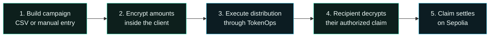

<div align="center">
  

  <br />

  <p>
    <strong>Confidential payroll, investor distributions, airdrops, and claims - encrypted onchain.</strong>
  </p>

  <p>
    Privlo gives teams a familiar distribution workflow while Zama FHE keeps every allocation private
    and TokenOps handles the confidential onchain execution.
  </p>

  <p>
    <a href="#quick-start"><strong>Run locally</strong></a>
    &nbsp;&middot;&nbsp;
    <a href="#how-to-use-privlo"><strong>How to use</strong></a>
    &nbsp;&middot;&nbsp;
    <a href="./docs/protocol-integration.md"><strong>Protocol notes</strong></a>
    &nbsp;&middot;&nbsp;
    <a href="./docs/video-pitch.md"><strong>Pitch script</strong></a>
  </p>

  <p>
    
    
    
    
    
  </p>
</div>

---

## About Privlo

Public blockchains make transfers verifiable, but they also expose sensitive financial
relationships. A payroll transaction can reveal compensation. An investor distribution can expose
allocation sizes. A public airdrop can reveal every recipient's balance.

**Privlo is the private distribution layer for onchain organizations.**

Creators prepare a campaign, encrypt each amount in the browser, and execute it through TokenOps'
pre-deployed confidential contracts. Recipients connect their own wallet, privately reveal only
their authorized amount, and claim it on Sepolia.

> **Privacy promise:** allocation amounts remain encrypted from campaign creation through recipient
> claim. Privlo does not intentionally publish plaintext amounts in transactions, URLs, analytics,
> or public campaign records.

## Why we built it

Onchain finance should be composable without forcing companies and contributors to publish their
entire financial graph. Privlo combines familiar EVM wallets and transaction flows with
programmable confidentiality, so privacy becomes part of the product rather than an extra manual
process.

<table>
  <tr>
    <td width="25%"><strong>Private payroll</strong><br />Pay contributors without publicly exposing individual compensation.</td>
    <td width="25%"><strong>Investor payouts</strong><br />Distribute confidential allocations while preserving onchain settlement.</td>
    <td width="25%"><strong>Encrypted airdrops</strong><br />Issue recipient-bound claims without publishing allocation amounts.</td>
    <td width="25%"><strong>Team distributions</strong><br />Move confidential ERC-7984 tokens across a team or community.</td>
  </tr>
</table>

## Product preview

### Privacy-first landing experience


### Wallet-scoped creator dashboard


The interface intentionally shows no fabricated volume, balances, campaigns, or claim data. Values
appear only when they can be derived from the connected wallet, Sepolia RPC, or confirmed Privlo
transactions.

## How it works



1. **Connect:** Privlo connects an injected wallet and enforces Sepolia before any write.
2. **Compose:** The creator chooses Disperse or Airdrop and enters recipients manually or by CSV.
3. **Encrypt:** Token amounts are converted using the token's real decimals and encrypted for the
   selected TokenOps contract.
4. **Execute:** Privlo performs TokenOps preflight checks, requests the required ERC-7984 operator
   approval, and submits the transaction.
5. **Reveal and claim:** The recipient obtains ACL access, requests Zama user decryption for their
   encrypted handle, then submits the original TokenOps claim authorization.

## Feature status

| Capability | Status | Notes |
| --- | :---: | --- |
| Wallet connection and network switching | Ready | Injected wallets, Sepolia enforcement, actionable errors |
| Manual recipient entry | Ready | Address, amount, duplicate, and decimal validation |
| CSV recipient import | Ready | Reviewable before encryption or submission |
| Confidential Disperse | Ready | Uses the TokenOps Sepolia singleton |
| Confidential Airdrop | Ready | Funding, encryption, EIP-712 authorization, and claim |
| Private recipient reveal | Ready | Zama ACL grant and user-scoped decryption |
| CTTT test-token faucet | Ready | Supports end-to-end Sepolia testing |
| Simple Vesting | Planned | Visible but deliberately disabled until execution is complete |
| Cross-device claim inbox | Integration point | Requires an authenticated API via `VITE_PRIVLO_API_URL` |

## Quick start

### Prerequisites

- [Node.js 22+](https://nodejs.org/)
- npm 10+
- A browser wallet such as MetaMask
- Sepolia ETH for transaction fees

### Install and run

```bash
git clone https://github.com/Datwebguy/privlo.git
cd privlo
npm install
```

Create your local environment file:

```bash
# Windows PowerShell
Copy-Item .env.example .env.local

# macOS or Linux
cp .env.example .env.local
```

Then start Vite:

```bash
npm run dev
```

Open **http://localhost:5173**.

### Environment variables

```dotenv
# Recommended: use a dedicated Sepolia RPC endpoint in production.
VITE_SEPOLIA_RPC_URL=https://ethereum-sepolia-rpc.publicnode.com

# Optional: omit to use Zama's public Sepolia relayer preset.
VITE_ZAMA_RELAYER_URL=

# Optional: authenticated claim delivery API for cross-device claims.
VITE_PRIVLO_API_URL=

# Optional: override TokenOps registry addresses when its deployment changes.
VITE_TOKENOPS_DISPERSE_ADDRESS=
VITE_TOKENOPS_AIRDROP_FACTORY_ADDRESS=
VITE_TOKENOPS_VESTING_FACTORY_ADDRESS=
```

No wallet private key belongs in these variables. Users sign transactions with their connected
wallet. Never put a private key in a `VITE_` variable: Vite exposes those values to the browser.

## How to use Privlo

### Create a confidential distribution

1. Open `/app` and connect the creator wallet.
2. Switch to Sepolia when prompted.
3. Select **Create campaign**.
4. Choose **Disperse** for immediate transfers or **Airdrop** for recipient claims.
5. Add a campaign name and an ERC-7984 confidential token address.
6. Add recipients manually or upload a CSV with `address` and `amount` columns.
7. Review recipients, totals, token decimals, and the TokenOps execution plan.
8. Approve the scoped operator request when required.
9. Confirm encryption and execution in the wallet.
10. Follow the real transaction hash from the confirmation screen.

Example CSV:

```csv
address,amount
0x1111111111111111111111111111111111111111,1250.50
0x2222222222222222222222222222222222222222,875.00
```

### Decrypt and claim

1. Open `/app/claims` with the recipient wallet.
2. Load the wallet's available claim authorizations.
3. Select **Decrypt and claim**.
4. Approve the Zama authorization signature when requested.
5. Privlo reveals the authorized amount only to that recipient.
6. Confirm the TokenOps claim transaction and follow its Sepolia receipt.

> During same-browser testing, claim authorizations are stored locally. Production delivery across
> devices requires the authenticated claim inbox described below.

## Architecture

```text
Wallet
  |
  v
wagmi + viem ---------------------------- Sepolia RPC
  |
  +--> Zama React Provider
  |      |
  |      +--> input encryption
  |      +--> ACL-scoped user decryption
  |
  +--> TokenOps SDK
         |
         +--> fhe-disperse
         +--> fhe-airdrop
         +--> fhe-vesting (planned)
         |
         v
   Pre-deployed TokenOps contracts
```

| Layer | Technology | Responsibility |
| --- | --- | --- |
| Product UI | React 18, TypeScript, Vite, Tailwind CSS | Responsive creator and recipient experiences |
| Wallet state | wagmi, viem, TanStack Query | Connection, Sepolia reads/writes, transaction state |
| Confidentiality | `@zama-fhe/sdk`, `@zama-fhe/react-sdk` | Encryption, permits, ACL-scoped decryption |
| Distribution | `@tokenops/sdk` subpath clients | Preflight, Disperse, Airdrop, and claim execution |
| Hosting | Vercel | Static Vite deployment and SPA routing |

## Zama and TokenOps integration

The provider in [`src/providers/web3-provider.tsx`](src/providers/web3-provider.tsx) composes wagmi,
TanStack Query, and `ZamaProvider`. It rebuilds the Zama configuration when the wallet changes so
credentials cannot remain accidentally associated with a previous signer.

The claim sequence in
[`src/hooks/use-private-claim.ts`](src/hooks/use-private-claim.ts) preserves the TokenOps signature
invariant:

1. `getClaimAmount` grants recipient ACL access and returns the receipt-derived encrypted handle.
2. Zama user decryption requests credentials scoped to that recipient and handle.
3. The Zama relayer returns the amount only to the authorized recipient.
4. TokenOps `claim` submits the original issuer-signed encrypted input.

The original encrypted input is never regenerated client-side because its EIP-712 signature commits
to that exact handle.

### Sepolia contracts

| Contract | Address |
| --- | --- |
| Confidential Disperse | [`0x710dD9885Cc9986EfD234E7719483147a6d8DBb4`](https://sepolia.etherscan.io/address/0x710dD9885Cc9986EfD234E7719483147a6d8DBb4) |
| Confidential Airdrop factory | [`0xbE6A3B78B36684fFee48De77d47Bc3393F5Acd4c`](https://sepolia.etherscan.io/address/0xbE6A3B78B36684fFee48De77d47Bc3393F5Acd4c) |
| Confidential Vesting factory | [`0xA87701CE9A52D43681600583a99c85b50DbE3150`](https://sepolia.etherscan.io/address/0xA87701CE9A52D43681600583a99c85b50DbE3150) |
| Confidential TokenOps test token | [`0x258F9D60dc023870e4E3109c894D834D5377361a`](https://sepolia.etherscan.io/address/0x258F9D60dc023870e4E3109c894D834D5377361a) |

> The Zama dependencies are pinned to `3.0.0` because TokenOps SDK `1.1.1` imports Zama 3.0 root
> exports at runtime. Upgrade these packages together after TokenOps publishes compatibility with a
> newer Zama SDK.

## Claim inbox API

TokenOps airdrop authorizations are recipient-bound offchain payloads and cannot be reconstructed
from public RPC logs. For cross-device production delivery, configure an authenticated service:

```http
POST /claims
Content-Type: application/json

{ "claims": [{ "recipient": "0x...", "claim": { "...": "..." } }] }
```

```http
GET /claims?recipient=0x...
```

The API must verify creator authorization on writes, verify recipient wallet ownership on reads,
rate-limit requests, isolate records by wallet, and mark authorizations consumed after claim
confirmation. It stores encrypted inputs and signatures, never plaintext allocations.

## Routes

| Route | Experience |
| --- | --- |
| `/` | Product landing page |
| `/app` | Wallet-scoped creator dashboard |
| `/app/campaigns/new` | Confidential campaign wizard |
| `/app/claims` | Private recipient reveal and claim |

## Project structure

```text
privlo/
|-- docs/
|   |-- assets/                 # README and product visuals
|   |-- protocol-integration.md # Protocol invariants and references
|   `-- video-pitch.md          # Three-minute demo pitch
|-- public/                     # Favicon and public assets
|-- src/
|   |-- components/             # Brand, campaign, UI, layout, wallet
|   |-- config/                 # Sepolia and chain configuration
|   |-- hooks/                  # Zama and TokenOps orchestration
|   |-- lib/                    # SDK clients and repositories
|   |-- pages/                  # Landing, dashboard, create, claims
|   |-- providers/              # wagmi, Query, and Zama providers
|   |-- styles/                 # Theme, animation, responsive styles
|   `-- types/                  # Campaign and claim domain types
|-- vercel.json                 # Build, SPA rewrites, caching, headers
`-- vite.config.ts
```

## Verification

```bash
npm run lint
npm run typecheck
npm run build
npm audit --omit=dev --audit-level=high
```

The current production build passes all four checks with zero reported npm vulnerabilities.

## Deploy to Vercel

1. Import [`Datwebguy/privlo`](https://github.com/Datwebguy/privlo) into Vercel.
2. Keep the detected **Vite** framework preset.
3. Select **Node.js 22**.
4. Add `VITE_SEPOLIA_RPC_URL` under Project Settings -> Environment Variables.
5. Add `VITE_PRIVLO_API_URL` after deploying the authenticated claim inbox.
6. Leave `VITE_ZAMA_RELAYER_URL` empty to use Zama's Sepolia preset.
7. Deploy and verify `/`, `/app`, `/app/campaigns/new`, and `/app/claims`.

[`vercel.json`](vercel.json) already defines the production build, `dist` output, SPA rewrites,
immutable asset caching, and baseline security headers.

## Security and production boundaries

- Never place wallet private keys, seed phrases, or issuer keys in frontend environment variables.
- Never log plaintext allocations or decrypted balances.
- Validate addresses, duplicate recipients, token decimals, batch limits, and totals before
  encryption.
- Use TokenOps preflight helpers before every write.
- Keep server-side issuer signing keys in an HSM or KMS-backed service.
- Do not regenerate a signed airdrop encrypted input.
- Clear Zama credentials when disconnecting wallets on shared devices.
- Persist only public campaign metadata; keep recipient authorization payloads behind wallet
  authentication.

This repository provides a functional Sepolia client. A public production launch still requires a
dedicated RPC provider, monitored hosting, and an authenticated claim inbox for cross-device
airdrop delivery.

## Zama Developer Program alignment

Privlo targets:

- **TokenOps Special Bounty:** confidential Disperse and Airdrop flows built on TokenOps'
  pre-deployed Sepolia contracts.
- **Builder Track:** a real-world confidential finance product with wallet-native UX and
  recipient-controlled private reveal.

The project demonstrates end-to-end encryption, programmable confidentiality, EVM composability,
and a practical financial workflow rather than a privacy-only technical demo.

## Documentation

- [Protocol integration and invariants](./docs/protocol-integration.md)
- [Developer Program submission checklist](./docs/developer-program-checklist.md)
- [Three-minute video pitch](./docs/video-pitch.md)

## License

Released under the [MIT License](./LICENSE).

<div align="center">
  <br />
  <strong>Privlo</strong><br />
  <sub>Private Financial Flows</sub>
</div>
